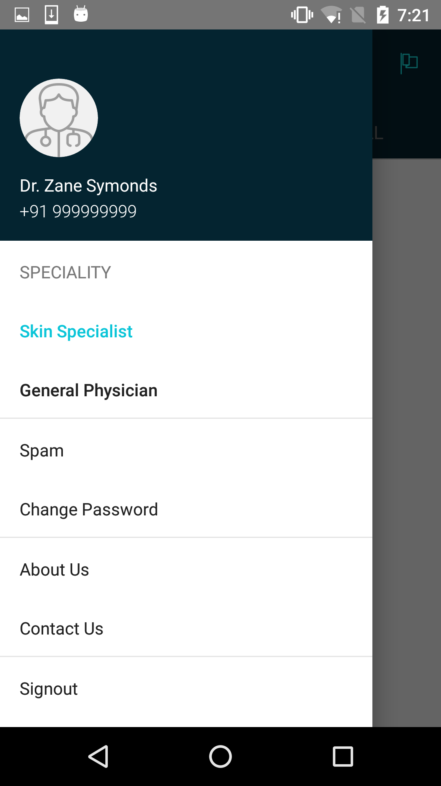

### Who's using React Native
We are in [good company](https://facebook.github.io/react-native/showcase.html).

### Package Manager
This app uses [yarn](https://github.com/yarnpkg/yarn) in favor of `npm`. The advantages include but might not be limited to:
* Deterministic dependencies i.e. no more 'works on my machine' errors.
* Caching and offline support for already installed modules.
* Faster installation due to efficient network utilization.

To install `yarn`:
```
npm i -g yarn
```

### Development
```
brew update
brew install watchman
brew cask install react-native-debugger
yarn global add react-native
git clone https://github.com/1mgOfficial/doctor-react-native && cd doctor-react-native
git checkout prototyping
yarn install
react-native run-ios
react-native run-android
```

### Troubleshooting
* Make sure you're running the latest stable `node` and `npm`.
* Make sure Xcode is installed along with required SDKs and emulator.
* Make sure Android Studio is installed along with required SDKs and emulator.
* [React Native Debugger](https://github.com/jhen0409/react-native-debugger)
* [React Native](https://facebook.github.io/react-native/docs/troubleshooting.html)
* [Running on Device](https://facebook.github.io/react-native/docs/running-on-device.html)

### Performance
When running the the app on real hardware, you might notice lags in animating between tabs or drops in frame rate elsewhere. This is because the app is running in `dev` mode and all production specific optimizations are turned off to facilitate faster code reloading if changes are made. To run the app in `production`:

1. Shake the device to open the developer menu.
2. Uncheck dev mode.
3. Check minify code.
4. Uncheck hot reload.
5. Uncheck live reload.
6. Uncheck remote debugging.
7. Reload app bundle.
8. Enjoy lag free animations.

__This app is tested on Android 4.2.1 Micromax A210 (2013) as baseline smartphone.__

### App State
This app uses `redux` for state management, `react-redux` for bindings, `redux-actions` for FSA compliant actions, `redux-effex` for async side effects and `redux-persist` for persisting state to `AsyncStorage`.


### Screenshots

| Current       | RN Android | RN iOS |
| ------------- | ---------- | ------ |
|   |   |  |
|   |   |  |
|   |   |  |
|   |   |  |
|   |   |  |
|   |   |  |
|   |   |  |
